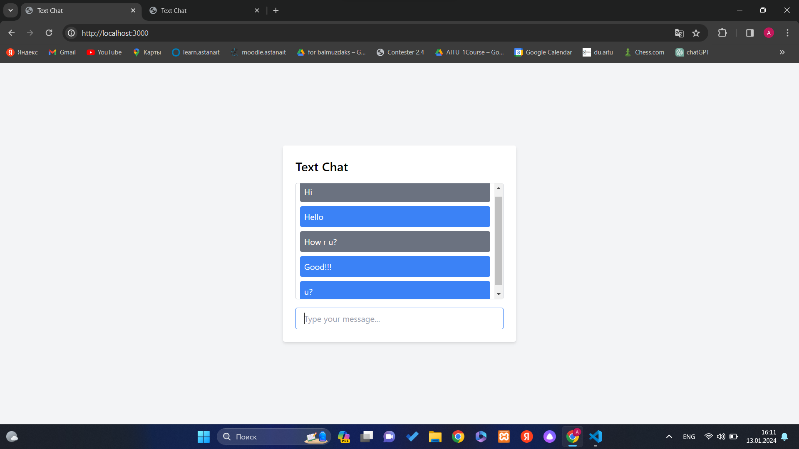
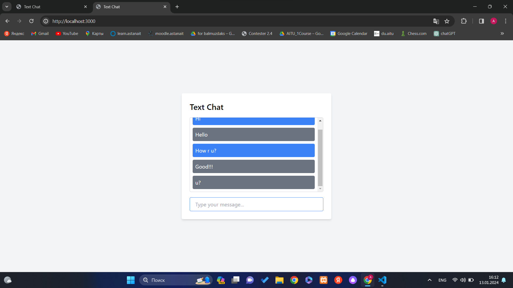
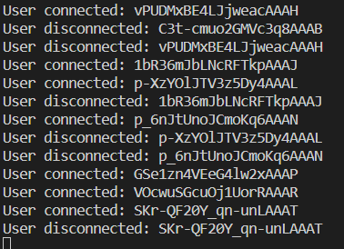

#1 
You should open and select all files and folders from zip. Move these files to your workspace.

#2
Running the Server (server.js):
Install Required Packages:

Open a terminal or command prompt.

Navigate to the directory where your server.js file is located.
cd /path/to/your/project

Run the following command to initialize a package.json file (if you don't have one already). Follow the prompts to set up your project.
npm init

Install the required packages (express, ws, socket.io) using the following command:
npm install express ws socket.io

Run the Server:

Start the server by running the following command:
node server.js

You should see a message indicating that the server is running on a specific port (default is 3000).

#3
Running the Client (index.html):
Open in a Browser:

Open your preferred web browser.
Navigate to http://localhost:3000 
Test the Chat Application:

You should see your "Real Time Messaging" HTML page.
Use the input field to send messages, and check if the messages are displayed in real-time.
Also you can see if users are connected to chat or not via VS Code Terminal:

Check the Other Routes:

Test the other routes defined in your server.js file:
/: Responds with a plain text message "hi".
/json: Responds with a JSON object containing a text property set to "hi" and a numbers property set to an array [1, 2, 3].
/echo?input=Hello: Responds with a JSON object containing the input in various formats.
/static/*: Serves static files from the "mychat" directory.
/chat?message=Hello: Emits a 'message' event with the provided message.
/sse: Establishes a Server-Sent Events (SSE) connection and sends messages in real-time to the client.

Server-Sent Events (SSE):

Open a new tab or window in your browser.
Navigate to http://localhost:3000/sse.
You should see real-time messages updating every second.

